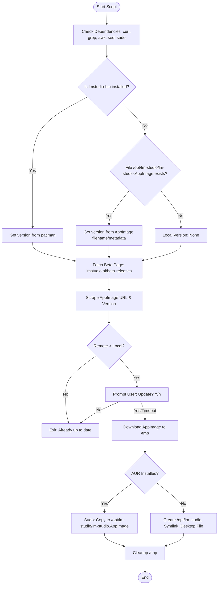

# Plan: LM Studio Beta Updater Script

## Overview
Create a Bash script (`lmstudio-beta-updater.sh`) to automate the discovery, download, and installation of LM Studio beta/stable releases on Arch Linux, ensuring compatibility with the `lmstudio-bin` AUR package structure.

## Workflow

## Technical Specifications

### 1. Environment & Version Discovery
- **AUR Check**: `pacman -Q lmstudio-bin`
- **Manual Check**: `test -f /opt/lm-studio/lm-studio.AppImage`
- **Local Version Extraction**:
    - If pacman: `pacman -Q lmstudio-bin | awk '{print $2}'`
    - If manual: Read strictly from `/opt/lm-studio/.version`. (Installation phase MUST write this file).

### 2. Scraping Strategy
- **Target**: `https://lmstudio.ai/beta-releases`
- **Regex**: `grep -oE 'https://[^"]+LM-Studio-[0-9a-zA-Z.-]+-x64\.AppImage'`
- **Fallback**: If no beta found, scrape `https://lmstudio.ai`.
- **Version Extraction**: Use `sed -n 's/.*LM-Studio-\(.*\)-x64.AppImage/\1/p'` to parse the clean version string from the URL.

### 3. Deployment (Standalone Mode)
- **Directory**: `/opt/lm-studio/`
- **Binary**: `/opt/lm-studio/lm-studio.AppImage` (chmod +x)
- **Version File**: `/opt/lm-studio/.version` (containing the exact version string)
- **Symlink**: `/usr/bin/lm-studio` -> `/opt/lm-studio/lm-studio.AppImage`
- **Desktop File**: Dynamically generate `/usr/share/applications/lmstudio.desktop` via heredoc.
- **Icon**: Use `/usr/share/icons/hicolor/512x512/apps/lmstudio-bin.png` if it exists.

### 4. Interactive Handling
- `read -t 15 -p "New version found! Update to beta? [Y/n] " response`
- Default to `Y` if timeout or empty response.

## Implementation Steps (Todo List)
See the integrated todo list in the environment.
