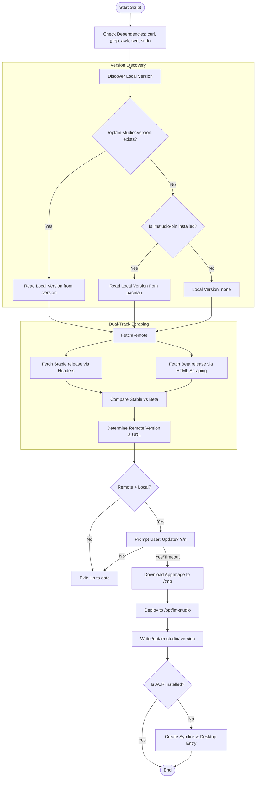

# Plan: LM Studio Beta Updater Script

## Overview
Create a Bash script (`lmstudio-beta-updater.sh`) to automate the discovery, download, and installation of LM Studio beta/stable releases on Arch Linux, ensuring compatibility with the `lmstudio-bin` AUR package structure while resolving update loops via independent version tracking.

## Workflow

## Technical Specifications

### 1. Environment & Version Discovery
- **AUR Detection**: Uses `pacman -Q lmstudio-bin` to set the `IS_AUR` flag, determining whether to skip system integration (symlinks/desktop files) during deployment.
- **Version Priority**:
    1. Read from `/opt/lm-studio/.version` (primary source of truth for the script).
    2. If missing and `IS_AUR=true`, fallback to `pacman -Q`.
    3. Otherwise, version is `none`.
- **Goal**: Prevents "update loops" where `pacman` reports an older version than the manually updated binary in `/opt/lm-studio`.

### 2. Scraping Strategy
- **Dual-Track Method**:
    - **Stable**: Inspects HTTP redirection headers via `curl -sI "https://lmstudio.ai/download/latest/linux/x64?format=AppImage"`.
    - **Beta**: Scrapes HTML content from `https://lmstudio.ai/beta-releases` using `grep` and `sed`.
- **Comparison**: Uses `sort -V` to compare stable and beta version strings, selecting the higher version as the deployment target.
- **Regex**: Extracts version from URL pattern `LM-Studio-(.*)-x64.AppImage`.

### 3. Deployment
- **Directory**: Hardcoded to `/opt/lm-studio/` to match AUR package conventions.
- **Binary**: `/opt/lm-studio/lm-studio.AppImage` (forced executable).
- **Version Tracking (Mandatory)**: Writes the exact version string to `/opt/lm-studio/.version` regardless of installation mode.
- **System Integration (Standalone only)**:
    - **Symlink**: `/usr/bin/lm-studio` points to the AppImage.
    - **Desktop File**: Dynamically generates `/usr/share/applications/lmstudio.desktop` via bash heredoc with appropriate categories and MIME types.

### 4. Interactive Handling
- 15-second timeout for user confirmation.
- Default to "Yes" to facilitate automated cron-like execution if desired.

## Implementation Steps (Todo List)
See the integrated todo list in the environment.
